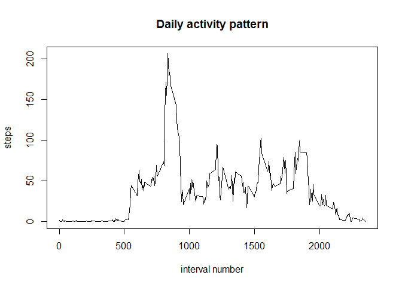
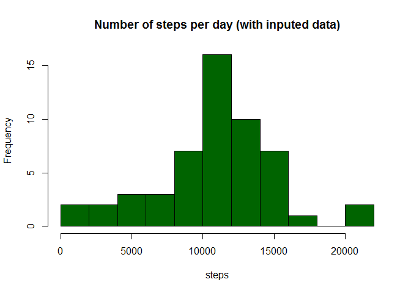
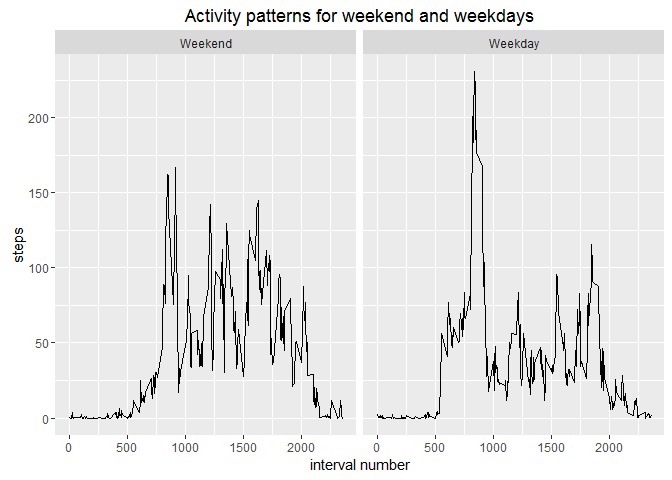

# Reproducible Research: Peer Assessment 1


This is course project 1

## Loading and preprocessing data

For this assignment the fist step is to load in the data. We also create a datafile wth no NAs


```r
if(!file.exists("activity.csv")) {unzip("activity.zip")}
activity <- read.csv("activity.csv")
activity$date <- as.Date(activity$date)

activityClear <- activity[!is.na(activity$steps),]
```

## What is mean total number of steps taken per day?

First we plot a histogram of number of steps aggregated by day


```r
# aggregate steps per day
stepsPerDay <- aggregate(steps ~ date, activityClear,sum)

# plot histogram
hist(stepsPerDay$steps,col = "darkgreen", breaks = 15, main = "Number of steps per day", xlab = "steps")
```


Now we compute mean and median of steps per day


```r
# mean and median of total steps per day
stepsMean <- mean(stepsPerDay$steps)
stepsMedian <- median(stepsPerDay$steps)
print(paste("Mean of steps per day is ",stepsMean," and median equals ",stepsMedian))
```

```
## [1] "Mean of steps per day is  10766.1886792453  and median equals  10765"
```


## What is the average daily activity pattern?

To fnd a daily activity pattern we aggregate steps by interval numbers take mean and plot it.


```r
# aggregate daily patterns
dailySteps <- aggregate(steps ~ interval, activityClear,mean)

# plot
plot(dailySteps$interval,dailySteps$steps,type = "l", main = "Daily activity pattern", xlab = "interval number", ylab = "steps")
```




## Imputing missing values

First we calculate and report the total number of missing values in the dataset. We create also a variable NAindexes which keeps the indexes where data is missing. It will be useful to us later.


```r
NAindexes <- which(is.na(activity$steps))
noNas <- length(NAindexes)
print(paste("There are ",noNas," missing values"))
```

```
## [1] "There are  2304  missing values"
```

We input missing data by assigning to a missing interval a mean for that interval across many days. We calculated those means in the previous question.


```r
fullActivity <- activity
fullActivity$steps[NAindexes] <- 
  dailySteps$steps[match(fullActivity$interval[NAindexes],dailySteps$interval)]
```

We can check if there are no missing values left.


```r
sum(is.na(fullActivity$steps))
```

```
## [1] 0
```

And now we can plot the histogram of total number of steps each day


```r
# aggregate steps per day
stepsPerDayFull <- aggregate(steps ~ date, activityClear,sum)

# plot histogram
hist(stepsPerDayFull$steps,col = "darkgreen", breaks = 15, main = "Number of steps per day (with inputed data)", xlab = "steps")
```



Now we compute mean and median of steps per day


```r
# mean and median of total steps per day
stepsMeanFull <- mean(stepsPerDay$steps)
stepsMedianFull <- median(stepsPerDay$steps)
print(paste("Mean of steps per day is ",stepsMeanFull," and median equals ",stepsMedianFull))
```

```
## [1] "Mean of steps per day is  10766.1886792453  and median equals  10765"
```


## Are there differences in activity patterns between weekdays and weekends?

For this part of the assignement first we need to create a factor variable for weekends and weekdays.


```r
Sys.setlocale("LC_TIME", "English")
```

```
## [1] "English_United States.1252"
```

```r
isWeekend <- (weekdays(fullActivity$date) == "Sunday" | weekdays(fullActivity$date) == "Saturday") 
fullActivity$daytype <- factor(isWeekend,levels = c(TRUE,FALSE),labels = c("Weekend","Weekday"))
```

Now we make a plot of activity patterns on weekend and weekdays. First we aggregate the data by interval and type of day (weekend or weekday). Then we plot a panel plot using ggplot2 library.


```r
dailyStepsFull <- aggregate(steps ~ interval+daytype,data = fullActivity,mean)

library(ggplot2)
g <- ggplot(data = dailyStepsFull, aes(x=interval,y=steps))
g + geom_line()+facet_wrap(~daytype)+xlab("interval number")+
  ggtitle("Activity patterns for weekend and weekdays")
```



This concludes the assignement.
